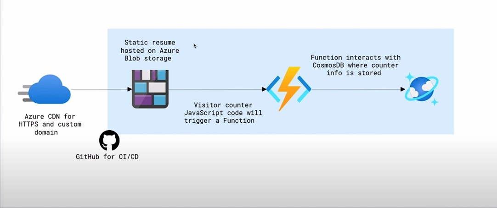

# Cloud Resume Challenge

This README follows the structure outlined in the [Cloud Resume Challenge Documentation](https://cloudresumechallenge.dev/docs/the-challenge/azure/).

---

## The Challenge Breakdown

### 1. **Certification**

- Completed the **AZ-900 Azure Fundamentals** certification to understand cloud concepts and Azure services.

### 2. **HTML/CSS**

- Designed a responsive static website using HTML and CSS.

### 3. **Static Website Hosting**

- Hosted the website via Azure Blob Storage.
  - Enabled static website hosting in the Azure Storage Account.
  - Uploaded and configured the static site files.

### 4. **Cloud Frontend**

- Connected the static website to Azure CDN for improved performance and global availability.

### 5. **Custom Domain**

- Configured a custom domain for the static website using Azure CDN.
  - Implemented HTTPS with Azure-managed certificates for secure access.

### 6. **Visitor Counter Backend**

- Built an Azure Function App in C# to track page views.
  - The function is triggered via an HTTP request.
  - Uses Azure Cosmos DB for storing visitor count.

### 7. **Database**

- Configured Azure Cosmos DB for storing the visitor data managed by the Function App.

### 8. **API Integration**

- Integrated the Azure Function with the static website to display the visitor count dynamically.

### 9. **CI/CD Pipeline**

- Set up a CI/CD pipeline with GitHub Actions for automatic deployments.
  - Pipeline deploys static website to Blob Storage.
  - Deploys the Function App to Azure.

### 10. **Infrastructure as Code**

- Used Azure Resource Manager (ARM) templates for consistent and automated resource deployment.

### 11. **Version Control**

- Managed all code and resources in a GitHub repository.
  - Included a detailed README and commit history.

### 12. **Blog Post**

- Wrote a blog post explaining the project setup, challenges faced, and learnings.
  - [Link to the blog post](#add-your-blog-link-here).

---

## Architecture Diagram



---

## Project Deployment

### Steps to Reproduce:

1. **Clone the Repository**:
   ```bash
   git clone <repository-url>
   ```
2. **Deploy Static Website**:
   - Upload HTML/CSS files to Azure Blob Storage.
   - Configure static website hosting and CDN.
3. **Set Up Function App**:
   - Deploy the C# Azure Function App using Visual Studio or Azure CLI.
4. **CI/CD Pipeline**:
   - Configure GitHub Actions workflow for automated deployments.

---

## Technologies Used

- **Azure Blob Storage**: Static website hosting.
- **Azure CDN**: Content delivery network for faster load times.
- **Azure Functions**: Backend serverless logic for page view tracking.
- **Azure Cosmos DB**: Visitor data storage.
- **GitHub Actions**: CI/CD pipeline for automated deployments.
- **C#**: Programming language for the Azure Function App.


